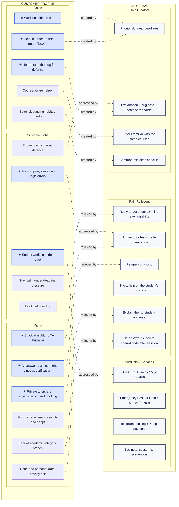

# CodeFix Express — Value Proposition Canvas

```mermaid
flowchart LR
  %% CodeFix Express — Value Proposition Canvas
  %% Paste into a GitHub Markdown file inside a ```mermaid code fence,
  %% or use GitHub's Mermaid preview.

  subgraph CUSTOMER["CUSTOMER PROFILE"]
    direction TB
    subgraph JOBS["Customer Jobs"]
      J1["★ Submit working code on time"]
      J2["★ Fix compiler, syntax and logic errors"]
      J3["Explain own code at defence"]
      J4["Stay calm under deadline pressure"]
      J5["Book help quickly"]
    end
    subgraph PAINS["Pains"]
      P1["★ Stuck at night; no TA available"]
      P2["★ AI answer is almost right / needs verification"]
      P3["★ Private tutors are expensive or need booking"]
      P4["Forums take time to search and adapt"]
      P5["Fear of academic-integrity breach"]
      P6["Code and personal-data privacy risk"]
    end
    subgraph GAINS["Gains"]
      G1["★ Working code on time"]
      G2["★ Help in under 15 min, under ₸3,000"]
      G3["★ Understand the bug for defence"]
      G4["Course-aware helper"]
      G5["Better debugging habits / mentor"]
    end
  end

  subgraph VALUE["VALUE MAP"]
    direction TB
    subgraph PRODUCTS["Products & Services"]
      S1["Quick Fix: 15 min • $5 (≈ ₸2,400)"]
      S2["Emergency Pass: 30 min • $12 (≈ ₸5,700)"]
      S3["Telegram booking + Kaspi payment"]
      S4["Bug note: cause, fix, prevention"]
    end
    subgraph RELIEVERS["Pain Relievers"]
      R1["Reply target under 15 min / evening shifts"]
      R2["Human tutor tests the fix on real code"]
      R3["Pay-per-fix pricing"]
      R4["1-to-1 help on the student's own code"]
      R5["Explain the fix; student applies it"]
      R6["No passwords; delete shared code after session"]
    end
    subgraph CREATORS["Gain Creators"]
      C1["Priority slot near deadlines"]
      C2["Explanation + bug note + defence rehearsal"]
      C3["Tutors familiar with the same courses"]
      C4["Common-mistakes checklist"]
    end
  end

  J1 -. addressed by .-> S1
  J2 -. addressed by .-> R2
  J3 -. addressed by .-> C2
  P1 -. relieved by .-> R1
  P2 -. relieved by .-> R2
  P3 -. relieved by .-> R3
  P5 -. relieved by .-> R5
  P6 -. relieved by .-> R6
  G1 -. created by .-> C1
  G2 -. created by .-> C1
  G3 -. created by .-> C2
  G4 -. created by .-> C3
  G5 -. created by .-> C4

  classDef priority fill:#dce5ff,stroke:#4b70dc,color:#1d274f,stroke-width:2px;
  classDef service fill:#f7f8fc,stroke:#1d274f,color:#1d274f;
  class J1,J2,P1,P2,P3,G1,G2,G3 priority;
  class S1,S2,S3,S4,R1,R2,R3,R4,R5,R6,C1,C2,C3,C4 service;
```
